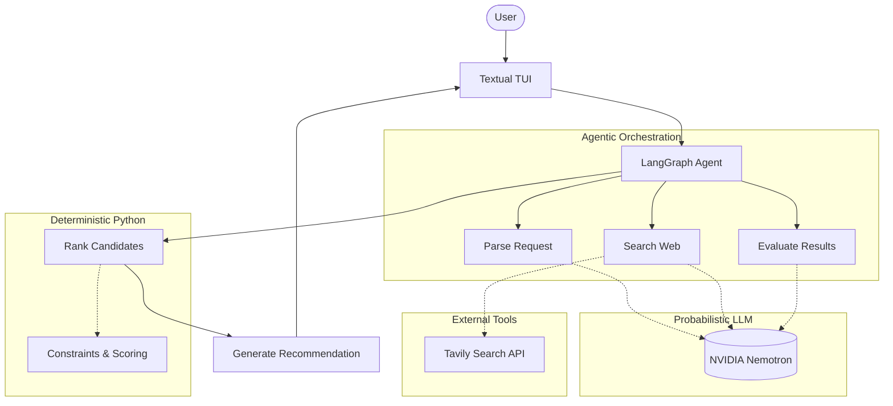

# Project Voyage

**Agentic flight research engine using LangGraph, LangChain, NVIDIA Nemotron, and Tavily.**

 *(Placeholder for Demo GIF)*

## What is Project Voyage?
Project Voyage is a terminal-based Agentic AI application that researches, evaluates, and recommends flight options. Unlike traditional flight search wrappers, Voyage uses an adaptive, agentic loop: if an initial search yields insufficient valid candidates based on user constraints, it explicitly reasons about the failure and expands its search strategy autonomously.

## Why I Built It
This project serves as a portfolio demonstration of **Forward Deployed Engineering** and **Agentic AI** capabilities. It demonstrates how to:
- Build stateful agentic workflows with bounded loops
- Isolate probabilistic LLM reasoning from deterministic business logic
- Gracefully handle failures and imperfect external data (web searches)
- Evaluate agent trajectories offline

## Try the Demo
You can experience the agent's behavior locally without any API keys using the built-in replay mode:
```bash
# Clone the repository
git clone https://github.com/akashdhr/project-voyage
cd project-voyage

# Create and activate virtual environment
python -m venv venv
source venv/bin/activate
pip install -r requirements.txt

# Run the TUI in replay mode
python -m app.tui --replay runs/example.json
```

## Example Query
> "Find the cheapest flight from Bangalore to London in October, flexible by ±3 days, maximum 1 stop, checked baggage required. Prefer British Airways but I'll pay up to ₹5,000 more for a significantly shorter flight."

## Agent Execution
The TUI provides real-time visibility into the agent's execution:
- **Status Pane**: Shows the current LangGraph node executing.
- **Search Iterations**: Shows the bounded loops and reasoning for retries.
- **Tool Activity**: Shows the precise web queries executed via Tavily.
- **Candidate Summary**: Displays deterministically filtered candidates in a table.

## Architecture



## Agentic Search Loop
The core of Project Voyage is the **adaptive search loop**. 
1. The agent parses the request.
2. It generates search queries and executes them.
3. It extracts candidate flights.
4. **Evaluation**: It explicitly evaluates if the candidates satisfy the constraints. If not, and if within the maximum iteration limit (default `3`), it generates a rationale (e.g. "Only 1 valid candidate found") and expands its search (e.g. searching Gatwick instead of Heathrow).

## LLM vs Deterministic Logic
- **NVIDIA Nemotron** handles natural language interpretation, search strategy formulation, result extraction, and final recommendation phrasing.
- **Python** handles deterministic hard constraints (max stops, baggage), deduplication, and ranking strategies (Cheapest, Fastest, Best Value). We never ask the LLM to perform math or strict sorting.

## Constraint Handling
- **Hard Constraints**: Must be satisfied (Origin, Destination, Dates, Max Stops, Baggage).
- **Soft Preferences**: Used for ranking (Preferred Airline, Willingness to pay more for speed).

## Evidence & Verification
Every candidate flight extracted includes evidence tracking:
- `source_url`: Where it was found.
- `evidence_score`: A deterministic 0-5 score based on data completeness.
- `verification_status`: Unverified web prices are explicitly labeled to manage user expectations.

## Evaluation
A golden evaluation suite is included in `tests/eval/eval_suite.py` to evaluate the LLM's parsing accuracy and the deterministic logic's correctness without requiring live API calls.

## Failure Recovery
The agent is designed to fail gracefully:
- Search timeouts trigger retries or alternate strategies.
- Zero results trigger query broadening.
- Poor quality extraction simply returns an empty list, allowing the `evaluate_node` to handle it.
- After reaching `MAX_SEARCH_ITERATIONS`, it terminates gracefully.

## Observability
- Application-level telemetry (iterations, candidate counts) is logged via `app/observability/logger.py`.
- Underlying execution traces can be viewed via **LangSmith** if configured.

## Tech Stack
- **Python 3.10+**
- **LangChain & LangGraph**: Orchestration and state management
- **NVIDIA NIM (Nemotron 3.5)**: Primary LLM
- **Tavily**: Web Research
- **Textual**: Terminal User Interface

## Running Locally (Live Mode)
```bash
cp .env.example .env
# Edit .env with your NVIDIA_API_KEY and TAVILY_API_KEY
python -m app.tui
```

## Limitations
- Web searches via Tavily are probabilistic and may not find live inventory.
- Real flight booking APIs (like Amadeus or SerpApi) would be required for production reliability.
- Deduplication is currently simple string matching on airline + flight number.

## Sample Agent Trace
```text
USER
Find me the cheapest flight from Bangalore to London in October. Max 1 stop, checked baggage required.

AGENT
Parsed request successfully.

SEARCH PLAN
Origin: BLR
Destination: LHR
Hard constraints: ≤1 stop, Baggage: True

SEARCH #1
Query: "BLR London October flights checked baggage"
Result: 8 candidate flights

EVALUATION
Decision: Search again
Reason: Only 1 candidate satisfies all hard constraints.
Action: Expand destination airport search to LGW.

SEARCH #2
Query: "BLR LGW October flights checked baggage"
Result: 14 additional candidates.

FILTERING
18 total candidates -> 3 satisfy hard constraints

RANKING
Cheapest: ₹69,800
Fastest: 10h 55m

RECOMMENDATION
I recommend QR 573 as the cheapest option, but BA 118 is faster with fewer stops.
```
