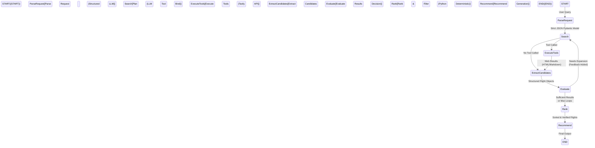

# ✈️ Project Voyage
**An Agentic Flight Research & Optimization Engine**

[](https://www.python.org/downloads/)
[](https://langchain.com)
[](https://build.nvidia.com/)

> **Project Voyage** is an autonomous AI agent designed to research, extract, and optimize flight itineraries from unstructured web data. Built from scratch with a focus on **Agentic AI fundamentals**, it demonstrates production-grade state orchestration, strictly-typed LLM tool calling, and the architectural separation of non-deterministic reasoning from deterministic business logic.

---

## 🏗️ Architecture & State Machine

Voyage is powered by a custom **LangGraph** state machine. Instead of relying on a black-box LLM chain, the agent operates in a highly controlled, cyclic workflow:



## 🧠 Design Philosophy

Building resilient LLM applications requires more than just sending text to an API. Project Voyage was built with strict engineering principles:

1. **Separation of Concerns:** The LLM is used strictly for semantic reasoning (parsing intent, planning queries, extracting unstructured text). Deterministic tasks (like filtering out flights that exceed a user's stop constraints or mathematically ranking prices) are explicitly handed back to **pure Python**.
2. **Self-Correction & Evaluative Loops:** After extracting data, the agent enters an explicit `Evaluate` node. If it determines prices are too high or data is lacking, it dynamically generates self-feedback (e.g., *"Try searching Gatwick instead of Heathrow"*) and routes back to the search node.
3. **Pydantic Validation:** All data entering and exiting the LLM is enforced via strict `Pydantic v2` schemas (e.g., `FlightSearchRequest`, `Flight`). 
4. **Native Streaming Observability:** Instead of relying on heavy third-party cloud trackers, Voyage intercepts LangGraph's native asynchronous event stream (`astream_events`) to broadcast local, real-time structured JSON logs of the agent's internal thought process.
5. **PII Data Scrubbing:** Built-in middleware uses regex to intercept user prompts and redact personal information (emails/phones) before requests ever reach external LLM providers.

## 🛠️ Tech Stack

- **Orchestration:** LangGraph (Stateful Agent Workflow)
- **Agent Intelligence:** `nvidia/nemotron-3.5-lightning-30b-a3b` via NVIDIA NIM (OpenAI compatible API)
- **Web Research:** Tavily Search API (Optimized LLM search results)
- **Data Modeling:** Pydantic v2 (Strict typing and validation)
- **Interface:** Textual (Python Terminal UI Framework)

## 🚀 Getting Started

### 1. Installation
Clone the repository and set up a virtual environment:
```bash
git clone https://github.com/akashdhr/project-voyage.git
cd project-voyage
python3 -m venv venv
source venv/bin/activate
pip install -e .
```

### 2. Configuration
Copy the environment template and securely add your API keys:
```bash
cp .env.example .env
```
Ensure your `.env` contains your active API keys:
```env
LLM_PROVIDER=nvidia
LLM_MODEL=nvidia/nemotron-3.5-lightning-30b-a3b
NVIDIA_API_KEY=your_nvidia_api_key_here
TAVILY_API_KEY=your_tavily_api_key_here
```

### 3. Run the Agent
Launch the interactive Terminal UI to chat with the agent in real-time:
```bash
python -m app.tui
```

*Watch as the agent dynamically streams its node transitions, tool calls, search expansions, and final ranked recommendations directly in your terminal.*